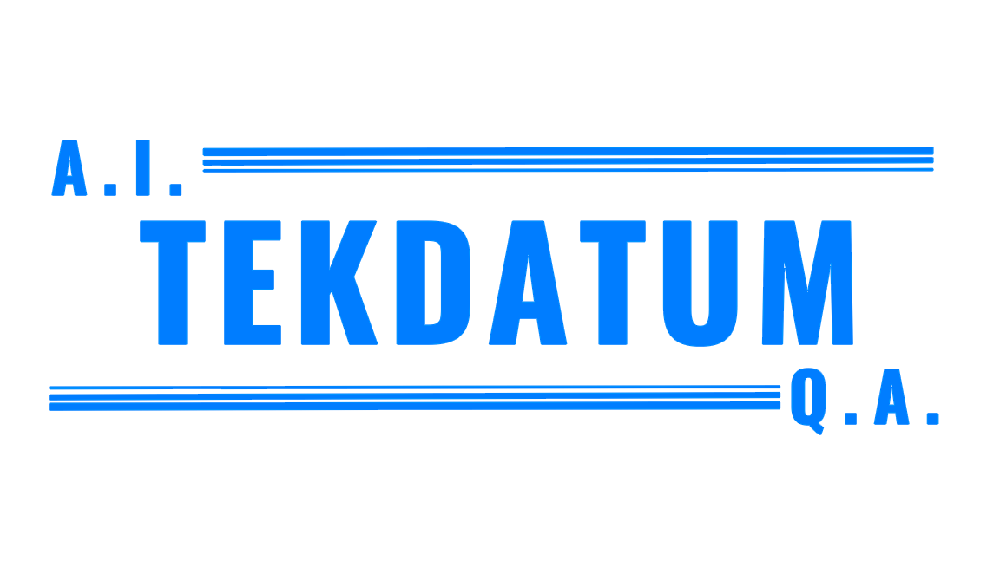

<!-- PROJECT LOGO -->
 

  

<!-- ABOUT THE PROJECT -->

## About TekDatum

TekDatum team is based in Houston, Chicago, and Costa Rica, with a wide range of skills and experience across several industries. We have vast experience developing and delivering Quality A.I. and Data Science related projects for multiple verticals. Companies rely on our high-performance, distributed Agile teams to enhance their existing resources and accelerate their time to success with cutting-edge technologies and guaranteeing high-quality standards.

Services:

- [QA and Automation](https://tekdatum.com/services/qa_automation)
- [Software Development](https://tekdatum.com/services/software_dev)
- [Data Science](https://tekdatum.com/services/data_science)
- [Data labeling](https://tekdatum.com/services/data_labeling)
- [Data Quality](https://tekdatum.com/services/data_quality)

### Technologies We Work With:

<table>
  <tr>
    <td></td>
    <td></td>
    <td></td>
    <td></td>
    <td></td>
  </tr>
  <tr>
    <td></td>
    <td></td>
    <td></td>
    <td></td>
    <td></td>
  <tr>
    <td></td>
    <td></td>
    <td></td>
    <td></td>
    <td></td>
  </tr>
  </tr>
  <tr>
    <td></td>
    <td></td>
    <td></td>
    <td></td>
    <td></td>
  </tr>
  <tr>
    <td></td>
    <td></td>
    <td></td>
    <td></td>
    <td></td>
</table>
